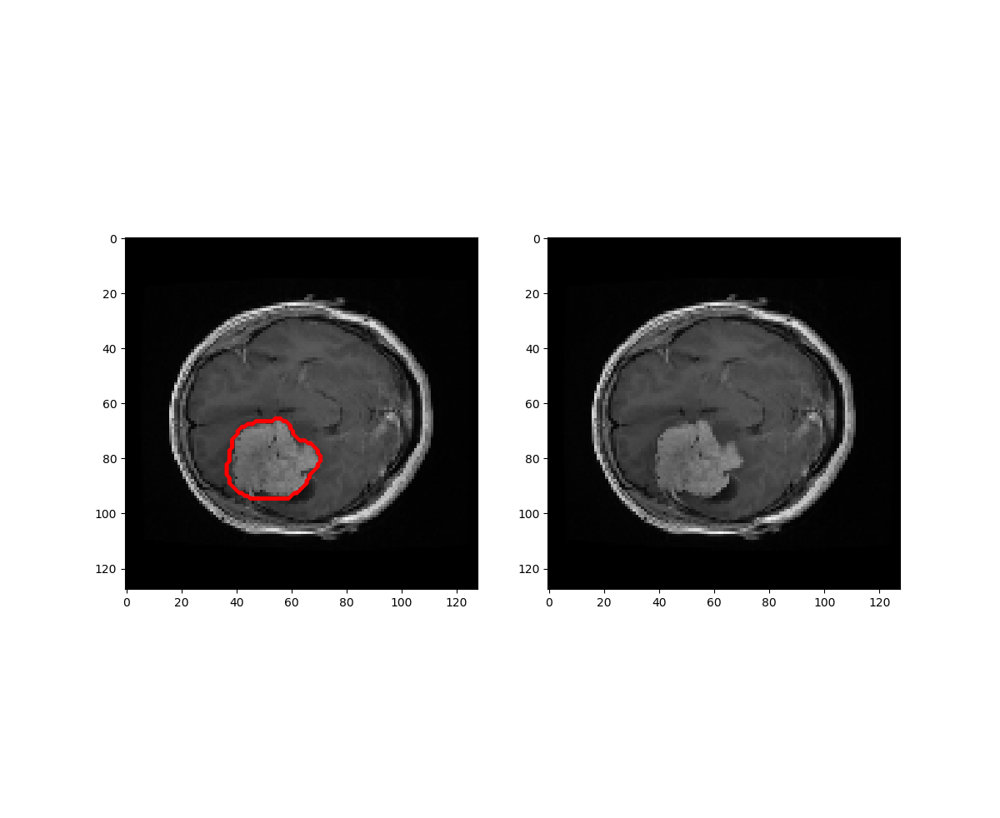

# Brain Tumor Segmentation

This repository provides code to brain tumor segmentation. Network architecture is U-net with dice loss as loss function.
Model has been implemented with few additional metrics:  precision, recall, f1 score, mean iou and dice score.

## Technologies
- Python 3.6
- Keras 
- U-Net architecture
- Skimage
- Sklearn
- OpenCV
- Numpy
- Matplotlib
